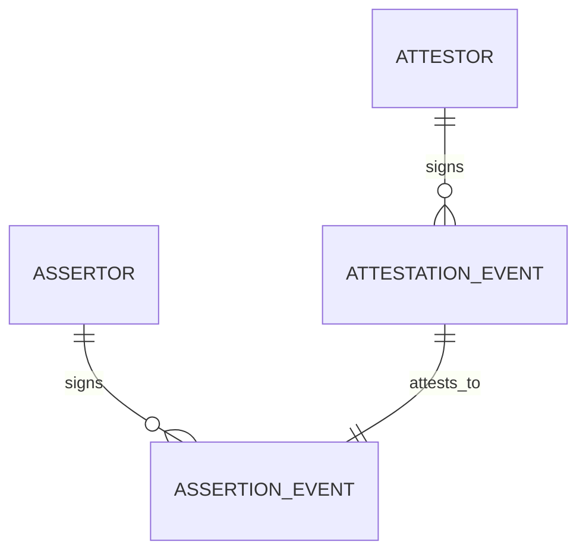
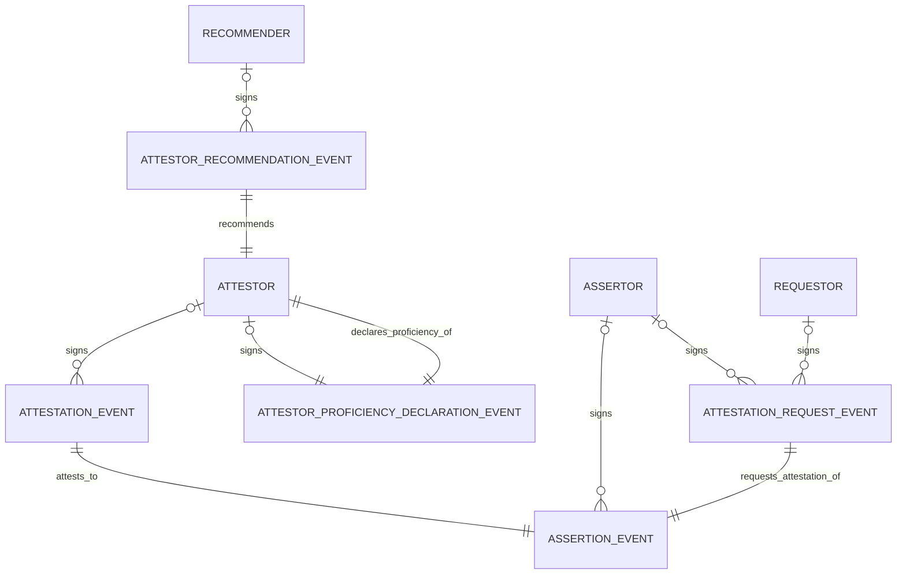

# Attestations

Source: `https://nostrhub.io/naddr1qvzqqqrcvypzp384u7n44r8rdq74988lqcmggww998jjg0rtzfd6dpufrxy9djk8qyfhwumn8ghj7un9d3shjtnyv9ujuct89uqqcct5w3jhxarpw35k7mnnaawl4h`

This file is a version copy of the Attestation NIP published on NostrHub, extended with the distributed lists approach adopted by Attestr.

---

# Abstract

Nostr lacks a standardized, interoperable way to make, track, and revoke truthfulness claims about Nostr events.

This NIP introduces Attestations, which provides a base structure to:
- **Make attestations** about that validity of *any other* event on Nostr of *any* kind;
- **Revoke attestations** about previous validity claims.

 This base Attestation structure can *optionally* be extended to:
- Manage simple attestation lifecycles;
- Request attestations from other npubs;
- Recommend individual attestation providers based on their proficiency in verifying given kinds;
- Publish your verification proficiency for given kinds.

Attestations enable a web of-trust for notes.

---

# Definitions

## Base Definitions

| Entity              | Definition                                                                        |
| ------------------- | --------------------------------------------------------------------------------- |
| `Assertor`          | Signer of the `Assertion Event`. Interchangeable with Attestee.                   |
| `Attestor`          | Verifying party and signer of the`Attestation Event`.                             |
| `Assertion Event`   | Event being attested to by the `Attestor`.                                        |
| `Attestation Event` | Event published by the `Attestor` to signal attestation of the `Assertion Event`. |



---

## Extended Definitions

| Entity                                   | Definition                                                                                   |
| ---------------------------------------- | -------------------------------------------------------------------------------------------- |
| `Requestor`                              | Signer of the `Attestation Request Event`.                                                   |
| `Recommender`                            | Signer of the  `Attestor Recommendation Event`.                                              |
| `Attestation Request Event`              | The request for an `Attestation Event` from an `Attestor`.                                   |
| `Attestor Recommendation Event`          | The recommendation of a given `Attestor` for proficiency in the verification of given kinds.  |
| `Attestor Proficiency Declaration Event` | A declaration of proficiency from a given `Attestor` in the verification of given kinds.      |



---

# Specification

### Event Kinds

| Kind    | Description                      | Type        |
| ------- | -------------------------------- | ----------- |
| `31871` | Attestation                      | Addressable |
| `31872` | Attestation Request              | Addressable |
| `31873` | Attestor Recommendation          | Addressable |
| `11871` | Attestor Proficiency Declaration | Replaceable |

---

## Tags

### Attestation Event (`31871`)

Event signed by the `Attestor`. The `Attestor` should only sign an `Attestation Event` after verifying the validity of the `Assertion Event` to a degree appropriate for its kind type.

| Tag          | Description                                                                                                                                                                                                                                                                                            | Format                                                                                                           | Required    |
| ------------ | ------------------------------------------------------------------------------------------------------------------------------------------------------------------------------------------------------------------------------------------------------------------------------------------------------ | ---------------------------------------------------------------------------------------------------------------- | ----------- |
| `d`          | Unique identifier for addressable attestation.                                                                                                                                                                                            | `["d", "<npub>:my-claim-id"]`                                                                                    | Yes         |
| `e` / `a` | Specific `Assertion Event`. Exactly one of `e` or `a` **must** be present.                                                                                                                                                                                                                     | `["e", "<event-id>"]` or `["a", "<kind>:<pubkey>:<d-tag>"]` | Yes         |
| `s`          | Marks an Attestation as being in only one of the following states: `verifying` - `valid` - `invalid` - `revoked`                                                                                                                          | `["s","verifying" <> "valid" <> "invalid" <> "revoked"]`                                               | Yes    |
| `valid_from` | Unix timestamp (seconds). The earliest time (inclusive) at which the attestation is valid from. Clients **should** interpret the absence of `valid_from` tag as having `validity`/`invalidity` from the `created_at` timestamp of the `Assertion Event`                                  | `["valid_from",1671217411]`                                                                                      | Optional    |
| `valid_to`   | UNIX timestamp (seconds). The latest time (inclusive) at which the attestation is valid from. Clients **should** interpret the absence of `valid_to` tag as having `validity`/`invalidity` in perpetuity.                                                                                | `["valid_from",1671567643]`                                                                                      | Optional    |
| `expiration` | UNIX timestamp (seconds). The time (inclusive) at which the `Attestation Event` will expire and be treated as such by relays in accordance to `NIP-40`. Clients **should** set this it be the same value as `valid_to` if there is no value in the `Attestation Event` being long-lived. | `["expiration",1671567643]`                                                                                      | Optional    |
| `request`    | `Attestation Request Event` that prompted this attestation.                                                                                                                                                                                                                                        | `["request", "31872:<requestor_pubkey>:<d-tag>"]`                                                                | Optional    |

`content` key should be used for optional human-readable description.

---

### Attestation Request (`31872`)

Event signed by the `Requestor` (usually the `Assertor`) requesting an `Attestation Event` from an `Attestor`.

| Tag           | Description                                                                                                                                                           | Format                                                      | Required |
| ------------- | --------------------------------------------------------------------------------------------------------------------------------------------------------------------- | ----------------------------------------------------------- | -------- |
| `d`           | Unique identifier for addressable attestation request.                                                                                                                | `["d", "<requestor_pubkey>:my-request-id"]`                 | Yes      |
| `e`/`a`   | Specific `Assertion Event` Exactly one of `e` or `a` must be present.                                                                                          | `["e", "<event-id>"]` or `["a", "<kind>:<pubkey>:<d-tag>"]`. | Yes      |
| `p`           | One or more requested `Attestors`. *Repeatable*.                                                                                                                                   | `["p", "<attestor_pubkey1>"]`                                | No       |
| `cashu_token` | A Cashu token locked to given spending conditions (HLTC, P2PK, etc.). Spending conditions *may* be locked to the observation of requested `Attestation Events`. | `["cashu_token", "<cashuBo...>"]`                           | No       |

---

### Attestor Recommendation (`31873`)

Event signed by the `Recommender`.

Allows any npub to recommend an `Attestor` for verification proficiency in one or more event kinds.

| Tag    | Description                                                      | Format                                           | Required |
| ------ | ---------------------------------------------------------------- | ------------------------------------------------ | -------- |
| `d`    | Unique identifier for the recommendation. | `["d", "<attestor_pubkey>:<recommendationid>"]`                       | Yes      |
| `p`           | Pubkey of recommended `Attestor`. | `["p", "<attestor_pubkey>"]` | Yes |
| `k`    | One or more event kinds the attestor is recommended for verifying.  *Repeatable*.         | `["k", "<kind1>"]`                    | Yes      |

`content` key should be used for optional human-readable description.

---

### Attestor Proficiency Declaration (`11871`)

Event signed by the `Attestor`.

Enables an attestor to publicly declare which event kinds they are proficient in verifying; facilitating discovery of suitable attestors for specific verification needs.

| Tag    | Description                                                       | Format                                       | Required |
| ------ | ----------------------------------------------------------------- | -------------------------------------------- | -------- |
| `k`    | One or more event kinds the attestor claims verification proficiency in.  *Repeatable*.        | `["k", "<kind>"]`                            | Yes      |

`content` key should be used for optional human-readable description.

---

# Worked Examples

## 1. Attestation Request

```json
{
  "kind": 31872,
  "tags": [
    ["d", "npub1requestor...:my-request-id"],
    ["a", "12345:npub1...:central-park-safety-assertion"],
    ["p", "npub1attestor1..."],
    ["p", "npub1attestor2..."]
  ],
  "content": "Verify safety status for Central Park"
}
```

## 2. Attestation

```json
{
  "kind": 31871,
  "tags": [
    ["d", "npub:safety-verification-2025"],
    ["a", "12345:npub1...:central-park-safety-assertion"],
    ["s", "valid"],
    ["valid_from", "1760227200"],
    ["valid_to",   "1760486400"],
    ["request", "request-event-id-123"]
  ],
  "content": "Safety inspection valid"
}
```

## 3. Revocation

```json
{
  "kind": 31871,
  "tags": [
    ["d", "npub:safety-verification-2025"],
    ["s", "revoked"]
  ],
  "content": "Retracted due to new safety concerns"
}
```

---

# Related NIPs

## NIP-03 - OpenTimestamps Attestations

An `Attestor`, `Assertor` or any other npub may choose to issue a `kind:1040` `OpenTimestamps Attestations for Events` event to anchor the `Attestation Event` to a given blockheight on the Bitcoin timechain.

## NIP-58 - Badges

An `Attestor` or any other npub may choose to issue a badge for a given `Attestation` should they wish.

---

# Distributed Lists for Attestor Trust and Proficiency

The core NIP defines attestation-specific kinds (`31873`, `31874`, `11871`) for attestor recommendations, trusted attestor sets, and proficiency declarations. In practice, these map cleanly onto a general-purpose distributed list pattern using kinds `30392`-`30395` (Trusted Lists). This section documents the adopted convention for expressing attestor trust policy using distributed lists alongside the original NIP kinds.

## Motivation

Using Trusted Lists (`30392`) for attestor trust and proficiency provides:

- A single retrieval model for policy, trust edges, and proficiency.
- Relay-indexed single-letter tags (`t`, `p`, `d`) for efficient filtering.
- Compatibility with NIP-85 Trusted Assertions infrastructure.
- A path to interoperability with other Nostr trust tooling.

The original NIP kinds (`31873`, `31874`, `11871`) remain valid. Trusted Lists are an alternative representation that clients may adopt for broader interoperability.

## Mapping from NIP Kinds to Trusted Lists

### `31873` Attestor Recommendation -> `30392` + `t=trusted-attestor`

A singular trust edge: "I recommend this attestor for these assertion kinds."

| NIP Kind Tag | Trusted Lists Tag |
|---|---|
| `k` tags | `t=k:<kind>` tags |
| `p` (recommended attestor) | `p` (same) |
| `d` (recommendation ID) | `d=trusted-attestor:<attestor_pubkey_hex>` |

### `31874` Trusted Attestors -> `30392` + `t=trusted-attestors`

A materialized trust set: "For assertion kind K, these are my trusted attestors."

| NIP Kind Tag | Trusted Lists Tag |
|---|---|
| `k` (single, assertion kind scope) | `t=k:<kind>` |
| `p` tags (trusted attestors, repeatable) | `p` tags (same) |
| `d=trusted-attestors:<kind>` | `d=trusted-attestors:<kind>` |

### `11871` Proficiency Declaration -> `30392` + self-referential `t=trusted-attestor`

A self-claim: the attestor recommends themselves for specific kinds.

| NIP Kind Tag | Trusted Lists Tag |
|---|---|
| `k` tags | `t=k:<kind>` tags |
| _(implicit: author is the attestor)_ | `p=<author_pubkey_hex>` (author == p) |
| _(no d tag)_ | `d=trusted-attestor:<author_pubkey_hex>` |

## Trusted Lists Event Shapes

### Trusted Attestor (singular trust edge)

```json
{
  "kind": 30392,
  "content": "",
  "tags": [
    ["d", "trusted-attestor:<trusted_attestor_pubkey_hex>"],
    ["t", "trusted-attestor"],
    ["t", "k:1"],
    ["t", "k:30023"],
    ["p", "<trusted_attestor_pubkey_hex>"]
  ]
}
```

### Trusted Attestors (policy list for an assertion kind)

```json
{
  "kind": 30392,
  "content": "",
  "tags": [
    ["d", "trusted-attestors:1"],
    ["t", "trusted-attestors"],
    ["t", "k:1"],
    ["p", "<attestor1_pubkey_hex>"],
    ["p", "<attestor2_pubkey_hex>"]
  ]
}
```

### Proficiency Self-Declaration (author == p)

```json
{
  "kind": 30392,
  "content": "",
  "tags": [
    ["d", "trusted-attestor:<attestor_pubkey_hex>"],
    ["t", "trusted-attestor"],
    ["t", "k:1"],
    ["t", "k:30023"],
    ["p", "<attestor_pubkey_hex>"]
  ]
}
```

Self-claim convention:
- `trusted-attestor` where `author == p` is interpreted as attestor proficiency/self-claim.
- `trusted-attestor` where `author != p` is interpreted as third-party trust/recommendation.

### Provider Output (trusted attestors produced for a specific user)

```json
{
  "kind": 30392,
  "content": "",
  "tags": [
    ["d", "trusted-attestors:<subject_pubkey_hex>:1"],
    ["t", "trusted-attestors"],
    ["t", "subject:<subject_pubkey_hex>"],
    ["t", "k:1"],
    ["p", "<attestor1_pubkey_hex>"],
    ["p", "<attestor2_pubkey_hex>"]
  ]
}
```

## Tag Convention Details

### Required semantics tags

- `t=<type>` where `<type>` is one of: `trusted-attestors`, `trusted-attestor`.

### `d` tag model (replacement identity)

Because Attestr multiplexes multiple trusted-list types in `30392`, `d` MUST be unique per list instance, not just the subject pubkey.

Recommended `d` formats:

- `trusted-attestors:<kind>` -- user's own policy list for a given assertion kind
- `trusted-attestor:<target_pubkey_hex>` -- singular trust edge to a specific attestor

Provider-output `d` formats (lists produced for other users):

- `trusted-attestors:<subject_pubkey_hex>:<kind>`
- `trusted-attestor:<subject_pubkey_hex>:<target_pubkey_hex>`

### Why both `t` type tags and `d`

- `d` is excellent for exact record lookup (`#d` with a known identifier).
- `d` is not suitable for efficient type-bucket discovery because prefix-based `#d` queries are not a portable assumption.
- `t=<type>` gives relay-indexed type filtering (`#t`) for broad discovery queries.
- Therefore, both are kept: `d` for record identity/replacement and `t` for type-level retrieval.

## Retrieval Queries

All queries below should use hex pubkeys in filters.

### A. Get trusted attestors for a user and assertion kind

```ts
const events = await nostr.query([{
  kinds: [30392],
  authors: [targetUserPubkey],
  '#d': ['trusted-attestors:1'],
  '#t': ['trusted-attestors', 'k:1'],
  limit: 20,
}]);

const attestors = events
  .flatMap((e) => e.tags.filter(([name]) => name === 'p').map(([, pk]) => pk));
```

### B. Get trusted-attestor signals from trusted sources for kind K

```ts
const events = await nostr.query([{
  kinds: [30392],
  authors: trustedSourcePubkeys,
  '#t': ['trusted-attestor', 'k:1'],
  limit: 200,
}]);

const trustedAttestors = events
  .flatMap((e) => e.tags.filter(([name]) => name === 'p').map(([, pk]) => pk));
```

### C. Get an attestor's self-declared proficiency

```ts
const events = await nostr.query([{
  kinds: [30392],
  authors: [attestorPubkey],
  '#d': [`trusted-attestor:${attestorPubkey}`],
  '#t': ['trusted-attestor'],
  limit: 20,
}]);

const kinds = events
  .filter((e) => e.tags.some(([name, value]) => name === 'p' && value === attestorPubkey))
  .flatMap((e) => e.tags.filter(([name, value]) => name === 't' && value.startsWith('k:')))
  .map(([, value]) => value.slice(2));
```

### D. Get provider-produced trusted attestors for a specific user and kind

```ts
const events = await nostr.query([{
  kinds: [30392],
  authors: trustedProviderPubkeys,
  '#d': [`trusted-attestors:${subjectPubkey}:1`],
  '#t': ['trusted-attestors', `subject:${subjectPubkey}`, 'k:1'],
  limit: 50,
}]);

const trustedAttestors = events
  .flatMap((e) => e.tags.filter(([name]) => name === 'p').map(([, pk]) => pk));
```

## Resolution Model

Recommended trust resolution precedence:

1. Explicit `trusted-attestors` policy (manual user-curated list via `30392` or `31874`)
2. Auto-generated `trusted-attestors` policy (from trusted recommendation sources)
3. Raw `trusted-attestor` edges (from `30392` or `31873`) only when no materialized policy is present

## Security Requirements

- For personal policy reads, filter by `authors: [currentUserPubkey]`.
- For trusted-attestor ingestion, filter by trusted source authors only.
- Never consume unfiltered public trusted-attestor lists as trusted input.

## Migration from NIP Kinds to Trusted Lists

### Rollout plan

1. **Dual-write phase**: Publish both legacy kinds and Trusted List equivalents.
2. **Dual-read phase**: Prefer Trusted Lists when present. Fallback to legacy kinds when missing.
3. **Cutover phase**: Stop writing legacy kinds after client adoption threshold.
4. **Legacy deprecation**: Keep read support for a transition window.

### Conflict handling

- If both legacy and Trusted List data exist, pick newest by `created_at`.
- If timestamps tie, prefer Trusted List variant.
- Deduplicate relation dimensions (`p` and `k`) before computing policy.

---

# NIP-85 Trusted Assertion Provider

Trusted Assertion Providers can operate as NIP-85 providers that publishes event validity scores so clients do not need to run trust graph calculations on-device.

## NIP-85 Subject Coverage

NIP-85 supports scoring for:

- `30382` - pubkey subject (`d = <pubkey>`)
- `30383` - regular event subject (`d = <event_id>`)
- `30384` - addressable event subject (`d = <kind:pubkey:d>`)
- `30385` - NIP-73 subject (`d = <i-tag>`)

For attestation validity of assertions, providers should primarily publish:

- `30383` for regular assertion events
- `30384` for addressable assertion events

## Output Tags

### Interoperable baseline

Use NIP-85 standard tag:

- `rank` (integer, normalized `0-100`)

### Optional extensions

Providers may include additional tags for stronger semantics:

- `attestation_score` (e.g. `0.00-1.00`)
- `confidence` (model confidence)
- `model` (algorithm name)
- `version` (algorithm version)

Clients that only support baseline NIP-85 can still use `rank`.

## Trust Delegation Model

Users delegate trust to providers with NIP-85 `kind:10040`.

Important: `10040` delegates trust to provider keys, not directly to attestor pubkeys.

Flow:

1. User publishes `10040` trusting provider key(s) for desired metrics (e.g. `30383:rank`, `30384:rank`).
2. Provider publishes trusted assertion results.
3. Client consumes only results authored by trusted provider keys.

## Policy Layer vs Scoring Layer

`31873`/`31874` (and their `30392` equivalents) are trust-policy primitives; NIP-85 events are trust-score outputs.

- **Policy layer** (`trusted-attestor` / `trusted-attestors`): Expresses who is trusted for what. Explicit, user-readable, useful for portability, auditing, and policy overrides.
- **Scoring layer** (NIP-85 `30383`/`30384`): Expresses what score a trusted provider computed. Quantitative, optimized for lightweight client consumption.

They are complementary, not redundant:

1. Use policy events as inputs and trust graph structure.
2. Provider computes validity/trust scores from those inputs (plus network signals).
3. Publish resulting scores via NIP-85 for client use without heavy on-device computation.

## Example: Event validity score (regular event)

```json
{
  "kind": 30383,
  "content": "",
  "tags": [
    ["d", "9f7f7f7c0d2b6c6fb1f2f9c3f0a26a8b845ecb19bb26b2df14b6c3d5f0b0aa12"],
    ["rank", "87"],
    ["k", "1"],
    ["attestation_score", "0.91"],
    ["confidence", "0.82"],
    ["model", "graperank-attestr"],
    ["version", "2026-03-26"]
  ]
}
```

## Example: Event validity score (addressable assertion)

```json
{
  "kind": 30384,
  "content": "",
  "tags": [
    ["d", "31871:aaaaaaaaaaaaaaaaaaaaaaaaaaaaaaaaaaaaaaaaaaaaaaaaaaaaaaaaaaaaaaaa:claim-123"],
    ["rank", "92"],
    ["k", "30023"],
    ["attestation_score", "0.95"],
    ["confidence", "0.88"],
    ["model", "graperank-attestr"],
    ["version", "2026-03-26"]
  ]
}
```
